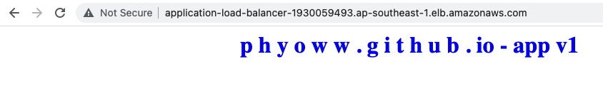

# aws-ec2-UserData-Blue-Green-Deployment-using-alb

# Steps
## 1. Create VPC, subnet, region code, AZ code with user input and export outputs. 
- [vpc.yaml](./vpc.yaml)

```bash
aws cloudformation create-stack --stack-name sgpvpc --template-body file://vpc.yaml --parameters ParameterKey='VPCCIDR',ParameterValue='192.168.0.0/16' ParameterKey='PublicSubnet1CIDR',ParameterValue='192.168.1.0/24' ParameterKey='PublicSubnet2CIDR',ParameterValue='192.168.2.0/24' ParameterKey='PublicSubnet3CIDR',ParameterValue='192.168.3.0/24' ParameterKey='RegionCode',ParameterValue='sgp' ParameterKey='AZ1Code',ParameterValue='sgpaz1' ParameterKey='AZ2Code',ParameterValue='sgpaz2' ParameterKey='AZ3Code',ParameterValue='sgpaz3'
```
## 2. Create custom security group, application loadbalancer security group with allow tcp "http" with outputs
- [vpc-securitygroup.yaml](./vpc-securitygroup.yaml)

```bash
aws cloudformation create-stack --stack-name sgvpc-securitygroup --template-body file://vpc-securitygroup.yaml --parameters ParameterKey='vpcStackName',ParameterValue='sgpvpc' 
```

## 3.Create web server V1 instance-1 with http service "p h y o w w . g i t h u b . io"
- [public-instance-v1.yaml](./public-instance-v1.yaml)

```bash
aws cloudformation create-stack --stack-name instancev1 --template-body file://public-instance-v1.yaml --parameters ParameterKey='vpcStackName',ParameterValue='sgpvpc' ParameterKey='vpcSecurityGroupStackName',ParameterValue='sgvpc-securitygroup' ParameterKey='appVersion',ParameterValue='v1'
```

## 4.Create web server V2 instance-1 with http service "p h y o w w . g i t h u b . io"
- [public-instance-v2.yaml](./public-instance-v2.yaml)

```bash
aws cloudformation create-stack --stack-name instancev2 --template-body file://public-instance-v2.yaml --parameters ParameterKey='vpcStackName',ParameterValue='sgpvpc' ParameterKey='vpcSecurityGroupStackName',ParameterValue='sgvpc-securitygroup' ParameterKey='appVersion',ParameterValue='v2'
```


## 5. Create Application loadbalancer , Loadbalaner listener , Application target group with outputs
- [alb.yaml](./alb.yaml)
```
aws cloudformation create-stack --stack-name alb --template-body file://alb.yaml
```
Test Result: 


```
➜  ~ while sleep 1; do curl -k "http://Application-Load-Balancer-491965461.ap-southeast-1.elb.amazonaws.com"; done
<html><h1 align='center'><p style='color:green'>p h y o w w . github . io - app v2</p></h1></html>
<html><h1 align='center'><p style='color:blue'>p h y o w w . g i t h u b . io - app v1</p></h1></html>
<html><h1 align='center'><p style='color:green'>p h y o w w . github . io - app v2</p></h1></html>
<html><h1 align='center'><p style='color:blue'>p h y o w w . g i t h u b . io - app v1</p></h1></html>
<html><h1 align='center'><p style='color:blue'>p h y o w w . g i t h u b . io - app v1</p></h1></html>
<html><h1 align='center'><p style='color:green'>p h y o w w . github . io - app v2</p></h1></html>
<html><h1 align='center'><p style='color:green'>p h y o w w . github . io - app v2</p></h1></html>
<html><h1 align='center'><p style='color:blue'>p h y o w w . g i t h u b . io - app v1</p></h1></html>
<html><h1 align='center'><p style='color:green'>p h y o w w . github . io - app v2</p></h1></html>
<html><h1 align='center'><p style='color:blue'>p h y o w w . g i t h u b . io - app v1</p></h1></html>
<html><h1 align='center'><p style='color:blue'>p h y o w w . g i t h u b . io - app v1</p></h1></html>
```
